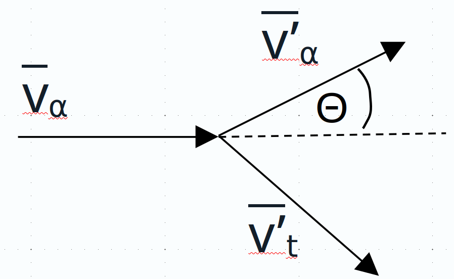

# Part 1: Investigating the microscopic World

## Resolving small structures

Light is a powerful tool for exploring structures, but its wavelength fundamentally limits the resolution achievable. At the end of the 16th century, the microscope was invented to resolve and observe small structures, initially mainly biological samples such as seeds, plants, the eye of a fly and the structure of cork. Hooke, one of the first to use a microscope described the pores inside the cork as ‘cells', the origin of the current use of the word in biology today.

In the classical limit, the smallest detail resolvable by conventional microscopy is approximately half the wavelength (2$\lambda$) of the light used. For visible light, this resolution limit is around 200-250 nanometers (nm), which is sufficient for resolving cells and large organelles, but far too large for atomic or molecular structures.

To resolve smaller structures like single crystals and individual atoms, which have characteristic spacings on the scale of $\approx 0.1$ to $1 \text{ nm}$ (or $1$ to $10 \text{ Angstroms}$), researchers must use "light" with a much shorter wavelength. For this, X-rays are commonly used as these have wavelengths comparable to the interatomic spacing in crystals. This allows for the determination of the atomic structure of crystals down to resolutions of $0.1 \text{ nm}$ or better, effectively resolving the positions of the constituent atoms.

To resolve structures smaller than the size of an atom's position, one must move beyond using light (photons) and instead employ beams of high-energy fundamental particles, such as electrons or other particles. The key principle remains the same as with light: to resolve a feature, the probe's de Broglie wavelength ($\lambda$) must be comparable to or smaller than the feature's size. High-energy electrons can have de Broglie wavelengths of less than $0.004 \text{ nm}$, significantly shorter than the atomic spacing of $\approx 0.1 \text{ nm}$. This extremely small wavelength allows modern electron microscopes to not only resolve the regular positions of atoms in a crystal lattice but also to image individual atoms and distinguish different elements within a material, achieving resolutions approaching $0.05 \text{ nm}$.

:::{admonition} Equation
:class: Warning
<b>The de Broglie wavelength</b>

In SI units (i.e. the international system of units {cite}`SIunits`) the de Broglie wavelength is defined as:
$$
\lambda = \frac{h}{p} \\
$$

Here, $\lambda$ is the wavelength, $h$ is the Planck constant, $p$ is the momentum with $h = 6.626 \times 10^{-34} m^2$ kg/s $=  6.626 \times 10^{-34} J s $
:::

Nuclear and Particle physics requires going to even smaller scales: Electrons and protons are most often used in order to test the structure of matter. Even when accelerated to modest velocities, they can probe features much smaller than atoms.

:::{admonition} Example
:class: tip
<b>Example: Wavelength of a proton travelling with $v=0.01c$</b>

$$
\begin{align*}
\lambda &= \frac{h}{p} \\
&= \frac{h}{m\times v} \\
&= \frac{6.625 \times 10^{-34}\, m^2 \, kg\, s^{-1}}{1.67 \times 10^{-27} kg \times 3 \times 10^6 \; m\, s^{-1}} = \frac{6.625 \times 10^{-34}\, m^{\cancel{2}}\, \cancel{kg}\, \cancel{s^{-1}}}{1.67 \times 10^{-27} \cancel{kg} \times 3 \times 10^6\, \cancel{m}\, \cancel{s^{-1}}} \\ \\
&= 1.32 \times 10^{-13} m = 132 fm
\end{align*}
$$

A Proton with a velocity of 1\% of the speed of light can probe structures more than a magnitude smaller as those accessible with X-Ray microscopes. Protons in
:::

### Orders of magnitude

Basic length scales in particle physics are determined by the sizes of the proton and the neutron which have a radius of about $10^{-15}$ m. Electrons are considered fundamental and their radius has been determined to be smaller than $10^{-18}$ m (this is an upper bound).

As the wavelengths in testing such small objects are small, the related frequencies ($v = \lambda \times f$) are large. 

Generally, this means, there are often orders of magnitudes involved when comparing values from particles physics to those in everyday life. Orders of magnitudes are factors (or powers) of 10 - as an example, the radius of the proton is 15 orders of magnitude smaller than a meter. Other ways to write this are:

$$
\begin{align*}
r_{\mathrm{proton}} \\
&= 0.000000000000001 m \\
& = 1 \times 10^{-15} m \\
& = 1E-15 m \\
&=  1e-15 m 
\end{align*}
$$

The last two option to express 15 order of magnitude come from computer science and are intended to make it easier to write $10^{15}$ on a computer/calculator. Alternatively, we can include these orders of magnitudes into units (this is how 1000m becomes 1 km). The below table of unit prefixes is extremely useful to understand orders of magnitudes involved in particle physics (and other research topics). 

*Table of Unit prefixes*

| Prefix  |	Symbol 	  | Factor              |	Power
|-------- |---------------|---------------------|----------------|
|tera 	  |T 	 	  | 1000000000000       |	$10^{12}$  |
|giga 	  |G 	 	  | 	1000000000      |	$10^9$	 |
|mega 	  |M 	 	  | 	1000000         |	$10^6$	 |	
|kilo 	  |k  	 	  |	1000 	        |	$10^3$	 |
|hecto 	  |h  	 	  |	100 		|	$10^2$	 |
|deca 	  |da 	 	  | 	10 		|	$10^1$	 |
|(none)   |	(none)    |	1 		|	$10^0$	 |
|deci 	  |d  	 	  |	0.1 		|	$10^{−1}$	 |
|centi 	  |c 	 	  | 	0.01 		|	$10^{−2}$	 |
|milli 	  |m 	 	  | 	0.001 		|	$10^{−3}$	| 
|micro 	  |$\mu$ 	  | 	0.000001 	|	$10^{−6}$	|
|nano 	  |n 	 	  | 	0.000000001 	|	$10^{−9}$	|
|pico 	  |p 	 	  | 	0.000000000001 	|	$10^{−12}$	|
|femto    |f		  | 	0.000000000000001 	|	$10^{−15}$|
|atto     |a		  | 	0.000000000000000001 	|	$10^{−18}$ |


There are many more examples where it is relevant to cover a large range of values (be it length scales, energies or frequencies) and to employ these prefixes or to even come up with special units. Learn more about how the largest and smallest scales in the universe are connected to each other in the optional material.

:::{admonition} Optional Material
:class: :octicons-info-16:
<b>Optional Material: From the biggest to the smallest scales</b>

Particle physics linked to the history of the universe from the Big Bang on: The first "objects" created in the big bang will have been the most fundamental particles that exist and their interaction has driven the evolution of the universe in its early stages. 

Matter and antimatter is assumed to have been produced in equal amounts in the Big Bang, and the particles in the early universe must have constantly annihilated with their antimatter counterparts into pure energy. However, at some point matter started to dominate over antimatter. The mechanism by which this happened is known as <b>Baryogenesis</b>. Various mechanisms how this happened are hypothesized, but all depend on the
interaction between fundamental particles as this was all there existed back then.

Following further expansion and cooling of the universe, the average energy per particles within the universe also decreases and electromagnetic 
and weak interactions split during the <b>Electroweak phase transition</b>. Some time later, protons and neutrons are formed during what is called the <b>Quantum chromodynamics phase transition </b>.

During <b>Nucleosynthesis</b> finally light nuclei are created, mainly $^2$H, $^3$He, $^4$He and $^7$Li. The Nucleosynthesis during the Big Bang depends on the value of the baryon asymmetry, so the observed amounts of light nuclei in the universe constraints the baryon asymmetry to a value rnge. 

Finally, the universe becomes transparent, when electrons and nuclei first form atoms and interact less interaction with photons. 

:::

### Special Units

The largess (or smallness) of the universe or of fundamental particles warrants using special units that are more appropriate, i.e. that is better aligned with what is measured or gives values closer to 1 for typical ranges. 

One example is the unit lightyears, used for distances in the universe because we use light to obtain information about space. At the same time, a lightyear (the distance traveled by light in a year) gives values that are smaller than those for conventional units with the distance sun-earth being 8 light-minutes instead of $8 \times 60 \times 300 000 000$ m.

Equally, the energy of small particles needs special units. This becomes evident when looking at how energy is defined in the Standard or [International System of Units](https://en.wikipedia.org/wiki/International_System_of_Units): One joule is equal to the work done when a force of one newton moves an object a distance of one metre or the energy required to accelerate a mass of 1 kg at an acceleration of 1 m/s$^2$ through a distance
of 1 m. It is also the work required to move an electric charge of one coulomb through an electrical potential difference of one volt. Clearly, these are *macroscopic* definitions (1kg of iron contains >> $10^26$ electrons), so energy per electron is expended is tiny. Clearly we need new definitions!

Analogously to the electric definition of a Joule, the energy of an electron is defined as the electron's energy after being accelerated through a potential difference of 1 V. This energy is defined as 1 electron-Volt (eV).

Similarly, the mass of a particle is defined based on their energy as:

$$ E = m c^2$$

Note: This is the relationship for in the non-relativistic case (i.e. momentum $p$ << energy). Here, momemtum << energy means that the energy is at least 2 orders of magnitude larger than the momentum. This part of the energy can be thought of as the *potential* energy of a particle.

The *kinetic* energy of a particle is defined as $E=pc$. So therefore once the momentum (or rather the kinetic energy) approaches the mass (or the potential energy) of a particle ($p \sim E$), the total energy of a particle is defined as the squared sum of these terms (due to special relativity, which yoiu will learn about in Y2): 

$$ E^2 = p^2 c^2 + m^2 c^4$$

| Quantity  |	Unit in Particle Physics	  | SI-Unit  |
|-----------|-------------------------------------|-----------|
|Energy	    |1 eV 	 	  | 1.602 $times 10^{-19}$ J  |
|Momentum   |1 MeV / c 	 	  | 5.34  $times 10^{-22}$ kg m/s |
|Mass 	    |1 MeV / c$^2$	  | 1.78 $times 10^{-30}$ kg  |	
|dalton or unified atomic mass unit|1 u = 931.5 MeV / c$^2$ | 1.66 $times 10^{-27}$ kg | 
|length     | 1 fm  | 10 $times 10^{-15}$ m | 


You will note, that the only difference between energy, momentum and mass are factors of $c$ (with $c$ being the speed of light). This would correspond to factors of 300 000 000 m/s - again not very practical. This is why instead of dividing by 300 000 000 m/s we either leave $c$ as a constant in the unit or we use "natural units", meaning we set c=1 (note: in this case energy, momentum and mass have the same units, eV).

So in summary, particle physics uses a specific system of units which is designed to make calculations easier - This is in contrast to the system of units that is normally used within physics, the International System of Units (SI) ({cite}`SIunits`)  which is metric and what you have been dealing with so far (and in future too).

Energy is generally measured in electron-Volt (eV). An electron volt is defined as the amount of kinetic energy gained by a single electron after being accelerated from rest through an electric potential difference of 1 Volt in vacuum:

$$ E_{\textrm{kin}} = q \cdot V $$

where $E_{\textrm{kin}}$ is the kinetic energy of the electron, $q$ is its charge and $V$ is the voltage (or voltage difference) with which it is accelerated. Given this definition, 1 eV $= 1.602 \times 10^{-19}$ J. So to convert from Joule into eV, one has to divide by $ 1.602 \times 10^{-19}$.

The unit eV is used to not only measure energy but also to measure momentum and mass. In particle physics, the relationship between energy, momentum and mass is derivated using special relativity and can be expressed in this simple formula:

:::{admonition} Equation
:class: Warning
<b>Relativistic relationship between energy, momentum and mass</b>

$$
E^2 = p^2 c^2 + m^2 c^4 \\
$$

Here, $E$ is the energy, $p$ is momentum, $m$ is mass and $c$ is the speed of light. In the case, that the kinetic energy of a particle can be neglected with respect to its mass, $E=mc^2$, the well-known Einstein formula. In cases, where the kinetic energy of a particle excess its mass, we can write $E=pc$. For most of the cases in this course, we will use $E=pc$ unless stated otherwise.
:::

:::{admonition} Example
:class: tip
<b>Example: Mass of the Proton</b>

$$
\begin{align*}
m c^2 &= 1.67 \times 10^{-27} kg \times \left( 3 \times 10^8 m/s \right)^2 = 1.5 \times 10^{-9} J / c^2 \\
1.5 \times 10^{-9} J &= 1.5 \times 10^{-9} / 1.6 \times 10^{-19}\; \textrm{eV} = 939 \;\; \textrm{MeV}
\end{align*}
$$

Note: These unit conversions are slightly unusual but they always proceed via the same pattern: convert into an energy using $E=pc$ or $E=mc^2$, adding factors of $c$ or $c^2$ into the unit such that nominally the quantity stays a "momentum" or a "mass" in terms of units (technically adding these factors cancels out the $c^2$ that was multiplied as well). Once we have an energy-like value, it can be converted into eV by division of $1.6 \times 10^{-19}$. Afterwards, $c=1$ to not have to carry it "around"/ write it down all the time. 
:::


## The Geiger-Marsden experiment

The Geiger-Marsden experiment, also known as the Rutherford experiment, is an experiment conducted in 1909 by Hans Geiger and Ernest Marsden under the guidance of Ernest Rutherford at the University of Manchester. The experiment was part of a series of experiments performed between 1906 and 1913 that investigated the atomic structure.

The experiment involved positively charged $\alpha$ particles (Helium nuclei consisting of two protons and two neutrons) that were guided in a beam at a thin sheet of gold foil. The source of the $\alpha$ particles was radium, as it was one of the most radioacive elements known at that time. Gold was chosen for the foil as it is the most malleable metal and therefore easiest material to manufacture a thin foil with. The deflection of the $\alpha$ particles was measured using a phosphorescent screen surrounding the gold foil. Each particle impacting on the screen produced a tiny flash of light that was detected "by eye": Geiger worked in a darkened laboratory for hours, counting the scintillations using a microscope and noting the results down.

The results showed that most alpha particles passed straight through the foil however some were deflected at large angles of more than 90 degrees and even up to 180 degrees. This disproved the plum pudding model of the atom that had been proposed by Thompson.

Rutherford drew the conclusion that atoms have a small, dense, positively charged nucleus as explained in his 1911 paper{cite}`Rutherford:1911zz` that eventually led to the widespread use of scattering in particle physics to study subatomic matter. The paper was primarily about alpha particle scattering in an era before particle scattering was a primary tool for physics.

In the following we will see how scattering experiments are used as a tool to understand the basic constituents of matter. The Geiger Marsden experiment is used to demonstrate the basic principles of these measurements.


```{admonition} Calculation
:class: Info

<b> Scattering angle in the Geiger Marsden Experiment</b>

From the scattering measured in the experiment, we can deduce something on the relationship of the $\alpha$ particles and the gold atoms (or the scattering centre).



Energy conservation:   $\,\,\,\,\,\,\,\,\,\, \frac{1}{2} m_\alpha {v^2_\alpha} = \frac{1}{2} m_\alpha {v'^2_\alpha} + \frac{1}{2} m_t {v'^2_t}$ <br>
Momentum conservation: $\,\,\, m_\alpha \vec{v_\alpha} = m_\alpha \vec{v'_\alpha} + m_t \vec{v'_t}$ <br>

Energy conservation:<br>
\begin{align*}
\frac{1}{2} m_\alpha {v^2_\alpha} &= \frac{1}{2} m_\alpha {v'^2_\alpha} + \frac{1}{2} m_t {v'^2_t} &\biggr\rvert \div\frac{1}{2} \\
m_\alpha {v^2_\alpha} &=  m_\alpha {v'^2_\alpha} +  m'_t {v'^2_t}  &\biggr\rvert \; \textrm{multiply by  } m_\alpha \\
m^2_\alpha {v^2_\alpha} &=  m^2_\alpha {v'^2_\alpha} +  m_\alpha m_t {v'^2_t} &
\end{align*}

Momentum conservation:<br>
\begin{align*}
m_\alpha \vec{v_\alpha} &= m_\alpha \vec{v'_\alpha} + m'_t \vec{v'_t} \; &\biggr\rvert \; \textrm{square both sides} \\
m^2_\alpha {v^2_\alpha} &= m^2_\alpha {v'^2_\alpha} + m^2_t {v'^2_t} + 2 m_\alpha m_t \vec{v'_\alpha}\cdot \vec{v'_t} \\
\end{align*}

Now set (2) and (3) equal:
\begin{align*}
\cancel{m^2_\alpha {v'^2_\alpha}} +  m_\alpha m_t {v'^2_t} &= \cancel{m^2_\alpha {v'^2_\alpha}} + m^2_t {v'^2_t} + 2 m_\alpha m_t \vec{v'_\alpha}\cdot \vec{v'_t} \\
m_\alpha m_t {v'^2_t} &= m^2_t {v'^2_t} + 2 m_\alpha m_t \vec{v'_\alpha}\cdot \vec{v'_t} \;\;\;\biggr\rvert \; - m^2_t {v'^2_t}, \div m_\alpha m_t  \\
{v'^2_t} \left(1 - \frac{m_t}{m_\alpha} \right) &= 2 \vec{v'_\alpha}\cdot \vec{v'_t} \\
{v'^2_t} \left(1 - \frac{m_t}{m_\alpha}\right) &= 2 {v'_\alpha}{v'_t} \cos\theta \\
\end{align*}


```

From the above calculation using energy and momentum conservation, we deduce the following relationship:

$${v'^2_t} \left(1 - \frac{m_t}{m_\alpha}\right) = {v'_\alpha}{v'_t} \cos\theta $$

We can analyse the equation without even knowing much about the concrete values:

Looking at the right-hand side, we find we have the multiplication of two velocities - this product is for sure positive (as there are not negative velocities). The other term on the right-hand side is $\cos\theta$ which is positive between -90$\degree$ and +90$\degree$. However, $\cos\theta$ is negative for any angles larger than 90$\degree$. So the right-hand side takes on a \textit{negative} value for scattering angles larger than 90$\degree$. This of course means, that also the left-hand side needs to be negative in these cases.

Therefore, let's take a look at the left-hand side of the equation. Again, ${v'^2_t}$ will always be positive, so $\left(1 - \frac{m_t}{m_\alpha}\right)$ needs to be negative, i.e. zero is larger than the left-hand side:

$$
\begin{align*}
0&>\left(1 - \frac{m_t}{m_\alpha}\right)\\
\frac{m_t}{m_\alpha} &> 1\\
m_t &> m_\alpha
\end{align*}
$$

This shows that the target mass is larger than that of the $\alpha$ particle. In fact it's much larger by roughly a factor of 40: M(Au) $\sim$ 40 $\times$ M(alpha). This indicates, there is a solid heavy "ball" inside the atom, not a soft distributed mass.

There is more we can learn, again using energy conservation. When the positively charged $\alpha$ particle approaches the also positively charged gold nucleus it experiences a repelling force and as a consequence its kinetic energy gets converted into potential energy until it (equivalent to a ball that is tossed into the air with an initial velocity, its kinetic energy gets converted into potential energy in the gravitational field of the earth until its velocity at its highest point is zero, at which point it turns to be accelerated by the gravitational towards earth).

Using this approach we can estimate the size of an atomic nuclei as we can estimate how close the $\alpha$ particles get towards it.

(#sizeofAU)=
```{admonition} Calculation

<b>Distance of closest approach in the Geiger Marsden Experiment</b>

The potential energy of the alpha particle with charge $q_\alpha$ at a distance $r$ from the gold nuclei with charge $Q_{\textrm{AU}}$ is:

$$
U = E_\textrm{pot} = \frac{q_\alpha Q_{\textrm{AU}}}{4 \pi \epsilon_0 r}
$$
(see also PHY11006 lecture notes: \textit{5.5 The Potential and Potential Energy of a System of Charges})

The $\alpha$ particles and the gold nuclei repell each other as they are both positively charged. In order to estimate how close they can get, we can compare the kinetic energy of the $\alpha$ particles to the potential energy caused by the charges. The kinetic energy is "used up" in order to overcome the repelling force of the electric field of the nuclei. Thus, the Kinetic energy (at t=0, i.e. when the particle approach from infinity) and potential energy are equal at the "distance of closest approach", the point at which the $\alpha$ particles are the closest to the gold nuclei, before they are deflected away from the nuclei.

The kinetic energy of the $\alpha$ particles in the Geiger Marsden experiment is $E_\textrm{kin} = 5.30$ MeV. The charges of the $\alpha$ particles and the gold nuclei are $q_\alpha = 2$e and $Q_\textrm{AU}=79$e respectively.

$$
\begin{align*}
E_\textrm{kin} &= E_\textrm{pot} \\
E_\textrm{kin} &= \frac{q_\alpha Q_{\textrm{AU}}}{4 \pi \epsilon_0 r} \;  \;  \;  \;  \; \biggr\rvert \div  E_\textrm{kin} ; \times r     \\
r &= \frac{q_\alpha Q_{\textrm{AU}}}{4 \pi \epsilon_0 E_\textrm{kin}}\\
 &= \frac{2 \times 79 \times (1.602 \times 10^{-19})^2 C^2 }{5.30 \times 1.602 \times 10^{-19} x 10^6 J} \times 9\times 10^9 \frac{N m^2}{C^2}\\
&= 4.3 \times 10^{-14} m \\ &= 43 fm
\end{align*}
$$

The $\alpha$ particles do not come closer than 43 fm to the nucleus - the nucleus therefore is smaller than this! (Compare with the Bohr radius of 0.053 nm which is $\sim$1000 larger)

```

## Discovering particles

Rutherford's experiments and similar scattering experiments of the time were seminal in establishing the existence of the nucleus, excitations of the nucleus and finally the existence of the proton. So by the mid-1920's the electron, photon and proton had been established as fundamental particles. Their properties in terms of charge and mass were deteremined and could be used to identify them.

This eventually lead to the discovery of new particles in photographs taken of cosmic rays: namely, the positron (the electron's anti-particle) and the muon. On the photographs, the trajectory of these particles were found that could not be identified with any of the known particles: The positron looked like an electrons but had opposite charge (evidenced by deflection in a magnetic field caused by the Lorentz-Force which we will cover later in this course). The muon was heavier than an electron but lighter than proton and first interpreted as a proton with some biases or systematics influencing the measurement. Today, it is understood that these particles are produced in collisions of highly energetic particles from out of space with the earth's atmosphere. The photographs also showed a third propoerty of fundamental particles: life-time. Some particle (such as the muon) are only stable for a characteristic amount of time until they decay.  


