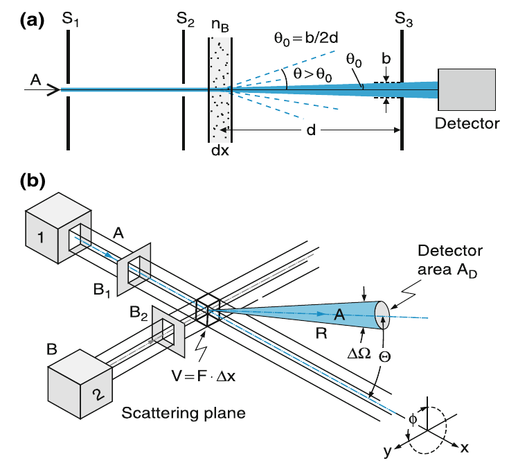
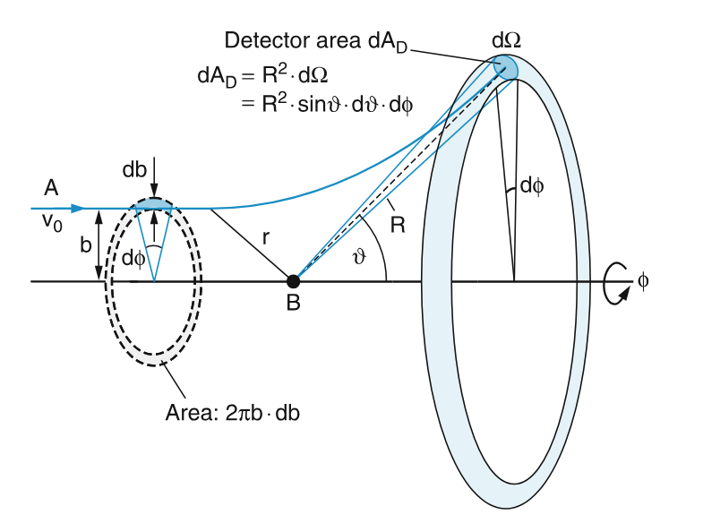

# Part 2a: General Basics of scattering experiments in High energy physics

## Cross-sections and their measurement

### What is a cross-section?

In the Geiger-Marsden experiment, whilst some $\alpha$ particles are scattered by large angle, others are not deflected at all. As we have seen, from the general considerations, we can determine an upper limit on the [size of the gold atoms](sizeofAU).

For the $\alpha$ particles, that are passing a gold foil, one can define the inclusive (or integral) cross-section as the area $\sigma = \pi r^2$ of the nuclei through which the $\alpha$ particles need to pass to be scattered by an detectable angle $\theta$. This is a generalisable definition: The cross section is used to quantify the effective size or the strength of an interaction with a particle. It does depend on the particle type as the size of the $\alpha$ particle and the gold nuclei play a role.

As we have calculated above, the radius and thus the area of a nuclei are very small ($\sim$ femto metres). Physicists during the second world war decided to invent a new unit for the cross sectional area of nuclei and nuclear reactions, one that would also be a bit more natural in size, and tried to come up with a name. They settled on "barns" (due to the rural background of one of the physicists involved and because some of the cross-sections were as large as a barn). Today barn is used all fields of high-energy physics a unit of area which is used in cross-sections and integrated luminosity.

One barn (abbr. b) is equal to 10$^{-28}$ m$^2$ or 10$^{-24}$ cm$^2$. This is a larger area, common are cross-section smaller than mb or nb (millibarns and nanobarns). Easiest to remember is probably 1 pb = 10$^{-12}$ b = 10$^{-36}$ cm$^2$

### Measurement of cross-sections

How can we determine a cross-section? The easiest way to conceptualize how cross-sections and their measurements work, is to look at inclusive (or integral) cross-section. Figure a) demonstrates the principle of the measurement of an inclusive cross-section. Consider a flux of particles $J = \Delta N / \Delta t$ passes though the target area (in Rutherford: the foil). The particle flux decreases as (i.e. changes by an infinitisimal amount):

$d J = -J \sigma_{inc} n_b dx = -J \sigma_{inc} N_b$

with J being the flux (per second impacting on an area), $\sigma_{inc}$ the inclusive cross-section, $n_b$ the particle density in the target and $d x$ being the thickness of the target (which can be increased in infinitissimal amount or finally be integrated over). $n_b dx$ is therefore effectively the number of target particles in the path of the flux (the number of particles passing in a unit of time). Basically you determine the inclusive cross-section by measuring how many particle where scattered out of the beam. This is corresponding to the rate of particles being scattered depending on initial flux, target particles and cross-section.



a) Measurement of the integral cross section $\sigma$. (b) Measurement of the differential cross section d$\sigma$/d$\Omega$ (taken from {cite}`Demtroder:AtomsMoleculesPhotons`)

The differential cross-section is determined as the particles flux scattered into the solid angle $\Delta \Omega$ accepted by the detector. It is demonstrate in Fig b) where a detector detects the flux of particles being scattered into its acceptance and can be expressed as:

$$\frac{\Delta J}{J A} = n_b \Delta x \frac{ d \sigma}{d \Omega} \Delta \Omega$$

with $J$ as the flux, A the area of the detector, $n_b \Delta x$ the number of target particles, $\frac{ d \sigma}{d \Omega}$ the differential cross-section which depends on the interaction potential between the scattering particles A and B. $\frac{\Delta J}{J A}$ is the fraction of incident particles that is scattered into the solid angle $\Delta \Omega$ accepted by the detector. Note that $\Delta J$ here is the actual number of events per second, not the flux. $\frac{ d \sigma}{d \Omega}$ denotes how the cross-section changes for infinitissimal changes of the angle $\Omega$. 

## The interpretation of the Geiger-Marsden experiment by Rutherford

As seen above, the mass of the nucleus is much larger than the mass of the $\alpha$ particles. So when Rutherford looked into deriving a formula to describe the scattering occuring the Geiger-Marsden experiment, he assumed, there is no energy loss in the collision, that is he ignores the recoil of the target atom. It also seems, that the electrons have no impact on the scattering as the size of the nucleus, the scattering centre is so much smaller than that of the atoms. Under these conditions, the $\alpha$ particle and nucleus interact through a central force, a physical problem studied already by Isaac Newton and that you have covered in {cite}`Y1Mech`. This problem considers a central force that only acts along a line between the particles and where the force varies with the inverse square, like Coulomb force in this case.

As shown in {cite}`Y1Mech`, a potential of the form $V = k/r$ will lead to the following relationship between the scattering angle and the impact parameter $b$:

$$cos \frac{\theta}{2} = \frac{m^2 b}{k}$$

with $\theta$ being the scattering angle (note: {cite}`Y1Mech` this is called $\phi$, but in particle physics this angle is always called $\theta$), $m$ the mass of the $\alpha$ particles, $k$ the parameters of the potential and $b$ the impact parameter or the point of closest approach, which is the vertical distance between the alpha particle's initial trajectory and the nucleus.

While $b$ might be a reasonable quantity to use in astronomical problems (Kepler used the same approach to calculate the movement of celestial bodies), it is not possible to measure $b$ in the Geiger-Marsden experiment. Therefore, the challenge is to find a way to relate the scattering angle to a quantity that can actually be measured in these sorts of scattering experiments and this is what Rutherford did to explain the experiment.

The procedure is the following:

- express the fraction of the flux passing through the band/annular $b$ and deflected by an angle $\theta$

- compare this to the general expression for the differential cross section

- connect it to the expression of the impact parameter derived using angular momentum and the potential ({cite}`Y1Mech`)



Geometrical layout of the Geiger-Marsden experiment as used by Rutherford (taken from {cite}`Demtroder:AtomsMoleculesPhotons`)


```{admonition} Calculation

<b> Rutherford scattering angle</b>

From geometrical considerations (i.e. just defining the rate of particles scattered into a solid angle without assuming anything more on the geometry) we can see that that:

```{math}
:label: my_label
\begin{align*}
\frac{\Delta J}{J A} = n_G \Delta x \frac{\mathrm{d}\sigma}{\mathrm{d}\Omega} \Delta \Omega 
\end{align*}

(note that Delta J 
```

```{admonition}
This is the general form of the differental cross-section.

Let us now assume a parallel beam of incident particles $\alpha$ with particle flux density J (with J = dN/dt) that passes through a layer of particles B in rest with density $n_\textrm{G}$. All particles $\alpha$ that pass through an annular with radius $b$ and width d$b$ around an atom G are deflected by the angle $\theta \pm \textrm{d}\theta/2$. This assumes a sperically symmetric interaction potential: There is no prefered direction (along the ring with radius $b$). Per second, $ dJ = J dA = dN/dt dA = dN/dt 2\pi b db$ particles $\alpha$ pass through the annular ring (with A being the area). The fraction of all particles $\alpha$ (incident per unit area and per second onto the target) scattered through an interaction with **one single** particle G into the range of deflection angles $\theta \pm \textrm{d}\theta/2$ is therefore:

\begin{align*}
\frac{\mathrm{d} J (\theta \pm 1/2 \; \mathrm{d}\theta)}{J} = 2 \pi b \textrm{d}b = 2 \pi b \frac{\textrm{d}b}{\textrm{d} \theta} \textrm{d} \theta
\end{align*}

If we place a detector with an area $A_D = R^2 \mathrm{d}\Omega = R^2 \sin\theta \mathrm{d}\theta\mathrm{d}\phi$ in a distance $R$ from the scattering centre G, then this detector receives a fraction of the particles scattered by this one particle G:

\begin{align*}
\frac{\mathrm{d} J (\theta, \phi)}{J} \frac{\textrm{d}\phi}{2\pi} = b \frac{\textrm{d}b}{\textrm{d} \theta} \textrm{d} \theta \textrm{d} \phi
\end{align*}

The fraction of *all* incident particles $\alpha$, scattered by *all* atoms G with density $n_G$ in the volume $V$ = $A \Delta x$ is then:

\begin{align*}
\frac{\mathrm{d} J (\theta, \textrm{d}\Omega)}{J} &= n_G A \Delta x b \frac{\textrm{d}b}{\textrm{d} \theta} \textrm{d} \theta \textrm{d} \phi 
\end{align*}

This is a specific cross-section (in terms of geometry) that takes into account the impact paramter $b$ and the scattering angle $\theta$. We can compared it to  {eq}`my_label` and find:

\begin{align*}
\frac{\mathrm{d} J}{J} &= n_G A \Delta x b \frac{\textrm{d}b}{\textrm{d} \theta} \textrm{d} \theta \textrm{d} \phi \\
&= n_G A \Delta x \frac{\mathrm{d}\sigma}{\mathrm{d}\Omega} \Delta \Omega
\end{align*}

Setting these two equal yields:
\begin{align*}
\cancel{n_G A \Delta x} b \frac{\textrm{d}b}{\textrm{d} \theta} \textrm{d} \theta \textrm{d} \phi & = \cancel{n_G A \Delta x} \frac{\mathrm{d}\sigma}{\mathrm{d}\Omega} \Delta \Omega  &\biggr\rvert \; \textrm{using} \Delta \Omega = \sin \theta \mathrm{d}\theta \mathrm{d}\phi \\
\frac{\textrm{d}b}{\textrm{d} \theta} \textrm{d} \theta \textrm{d} \phi & =  \frac{\mathrm{d}\sigma}{\mathrm{d}\Omega} \sin \theta \mathrm{d}\theta \mathrm{d}\phi 
\end{align*}

This gives a relationship between the differential cross-section and the impact parameter and scattering angle: 

```{math}
:label: my_label2
\begin{align*}
\boxed{\frac{\mathrm{d} \sigma}{\mathrm{d}\Omega} = b \frac{ \mathrm{d} b}{\mathrm{d} \theta} \frac{1}{\sin \theta}}
\end{align*}
```

```{admonition}

Measuring the relative fraction $\frac{\Delta J}{J}$ yields the differential cross section (see {eq}`my_label`) and with it the interaction potential as we have seen that the angle $\theta$ is defined as (see eq. (72) of the mechanics lecture notes):

\begin{align*}
\cot\frac{\theta}{2} = \frac{m v_0^2 b}{k} = \frac{m v_0^2 b}{1} \frac{4 \pi \epsilon_0}{qQ} 
\end{align*}

Note, that the mechanics lecture notes eq. (72) use $\phi$ - this is the same angle, just a different name. For scattering angles, especially in particle physics, the angle is $\theta$, so this is what we use here. We can re-arrage the equation to get the relationship for $b$:

\begin{align*}
\cot\frac{\theta}{2} &= \frac{m v_0^2 b}{1} \frac{4 \pi \epsilon_0}{qQ} \\
b &= cot\frac{\theta}{2} \frac{qQ}{m v_0^2 4 \pi \epsilon_0}
\end{align*}

We from this last equation we can also get $\frac{\mathrm{d}b}{\mathrm{d}\theta}$ by taking the derivative:

\begin{align*}
\frac{\mathrm{d}b}{\mathrm{d}\theta} &= -\frac{1}{\sin^2(\theta/2)} \frac{qQ}{m v_0^2 4 \pi \epsilon_0}
\end{align*}

As $b$ cannot be measured, we eliminated it from from {eq}`my_label2` by inserting the above expression for $b$ and use $\sin(2\theta) = 2 \sin(\theta) \cos(\theta)$:
\begin{align*}
\frac{\mathrm{d} \sigma}{\mathrm{d}\Omega} &= b \frac{ \mathrm{d} b}{\mathrm{d} \theta} \frac{1}{\sin \theta} \\
&= \frac{\cancel{\cos(\theta/2)}}{\sin(\theta/2)}  \frac{qQ}{m v_0^2 4 \pi \epsilon_0} \frac{1}{\sin^2(\theta/2)} \frac{qQ}{m v_0^2 4 \pi \epsilon_0} \frac{1}{2 \sin(\theta/2) \cancel{\cos(\theta/2)}} \\ 
\end{align*}

This finally yields:

\begin{align*}
\boxed{\frac{\mathrm{d} \sigma}{\mathrm{d}\Omega} = \frac{1}{4} \left( \frac{qQ}{m v_0^2 4 \pi \epsilon_0} \right)^2 \frac{1}{\sin^4(\theta/2)} } 
\end{align*}

**This is the formula for Rutherford scattering!!** 

```

This formula analytically describes Rutherford scattering which is the elastic scattering of charged particles by the Coulomb interaction, sometimes also called Coulomb scattering.


```{admonition} Learning objectives
:class: Tip


### Cross-Sections and Units

* Define inclusive (integral) and differential cross-sections and explain their physical significance as measures of interaction probability or effective target area.


* Express cross-section values using standard nuclear and particle physics units, including barns ($\text{b}$), millibarns ($\text{mb}$), nanobarns ($\text{nb}$), and picobarns ($\text{pb}$), converting between these and $\text{m}^2$ or $\text{cm}^2$.


### Experimental Measurement of Cross-Sections

* Relate incident particle flux ($J$), target particle density ($n_b$), target thickness ($\Delta x$), and inclusive cross-section ($\sigma_{\text{inc}}$) to calculate particle beam attenuation or total scattering rate.


%* Formulate the relationship between differential cross-section ($\frac{\text{d}\sigma}{\text{d}\Omega}$), solid angle ($\Delta \Omega$), incident flux, target properties, and the fraction of particles scattered into a detector.


### Rutherford Scattering Derivation and Analysis

* State the simplifying physical assumptions underlying Rutherford scattering (no target recoil, negligible electron shielding, pure central Coulomb potential).


%* Relate the impact parameter ($b$) to the scattering angle ($\theta$) for a central $1/r$ Coulomb potential.


%* Derive the geometric relationship connecting differential cross-section to impact parameter: $\frac{\text{d}\sigma}{\text{d}\Omega} = \frac{b}{\sin\theta} \left\vert{} \frac{\text{d}b}{\text{d}\theta} \right\vert{}$.


* **Apply** (NOT: derive) the differential cross-section formula for Rutherford scattering:

$$\frac{\text{d}\sigma}{\text{d}\Omega} = \frac{1}{4} \left( \frac{q Q}{4\pi \epsilon_0 m v_0^2} \right)^2 \frac{1}{\sin^4(\theta/2)}$$


```

